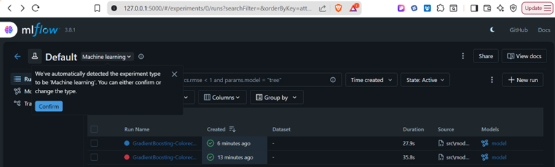
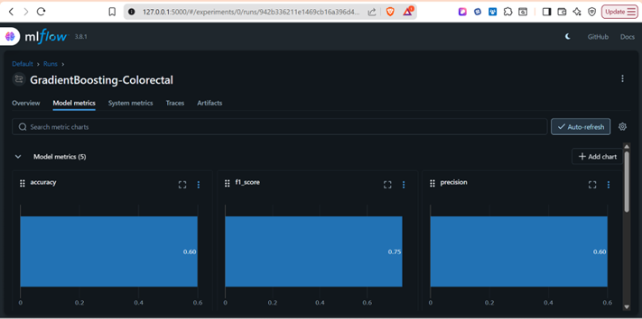
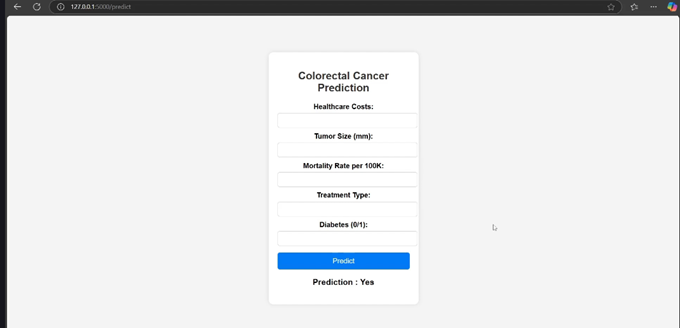
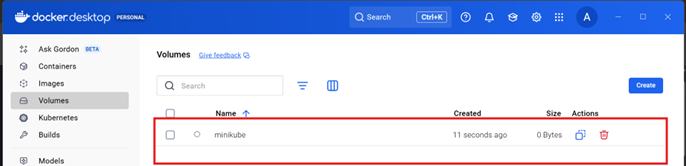
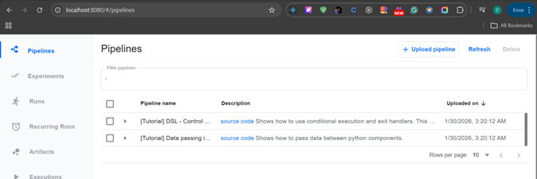
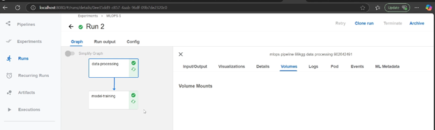

# Colorectal Cancer Patient Survival Prediction 🏥

## 🔷 1. Project Overview
This project is a **prognostic tool** designed to predict the survival probability of patients already diagnosed with colorectal cancer. By leveraging large-scale medical data, the system performs binary classification to assist healthcare providers in risk stratification.

* **Primary Goal:** Binary Classification (Survival Prediction).
* **Key Distinction:** This is **not** a diagnostic tool (detecting cancer); it is a **prognostic tool** (predicting outcomes for existing patients).

---

## 🔷 2. Clinical Context
Colorectal cancer originates in the large intestine (colon or rectum). While highly treatable in early stages, the survival rate drops significantly at **Stage 4 (Metastasis)**.

* **Demographics:** Primarily affects individuals over 50.
* **Leading Causes:** Genetics (Family history) and Lifestyle (Smoking, Alcohol, Diet).
* **Diagnosis:** Primarily via Colonoscopy.
* **Treatments:** Surgery, Chemotherapy, and Radiotherapy.

---

## 🔷 3. Technical Stack & Innovations
The project emphasizes **"Local-to-Cloud" parity**, ensuring the local development environment mirrors professional cloud architectures using a cost-effective MLOps stack.

| Technology | Purpose | Key Shift |
| :--- | :--- | :--- |
| **MLflow + DagsHub** | Experiment Tracking | Moving from local to online tracking |
| **Minikube** | Local Kubernetes | Moving from GCP-based K8s to local cluster |
| **Kubeflow Pipelines** | Pipeline Orchestration | Foundation for tools like Vertex AI |
| **Docker Hub** | Image Registry | Replacing GCR (Google Container Registry) |

> 📌 **Note:** Learning Minikube is essential for mastering advanced MLOps workflows on a personal machine without incurring cloud costs.

---

## 🔷 4. Dataset & Real-World Impact
* **Source:** Kaggle (Colorectal Cancer Global Dataset).
* **Scale:** ~167,000 patient records.
* **Target Audience:** Hospitals, Nursing Homes, and Medical Researchers.

### 🧑‍⚕️ Clinical Use Cases
1.  **Patient Monitoring:** Acts as a "digital warning sign" to motivate behavioral changes.
2.  **Resource Allocation:** Triage patients by risk to prioritize ICU beds and specialized staff.
3.  **Clinical Interventions:** Fast-tracking high-risk patients into experimental drug trials.

---

## 🔷 5. The MLOps Workflow

### Phase 1: The Experimentation Lab (Jupyter) 🧪
* Data cleaning, EDA, Feature Engineering, and Model Selection.
* **Transition:** Converting notebook logic into **Modular Production Code** (Classes/Methods).

### Phase 2: Versioning & Tracking 📊
* **Code/Data:** Managed via GitHub.
* **Experiments:** Connected to DagsHub. Metrics and parameters are tracked in real-time.

### Phase 3: User Interface (Flask) 🧑‍💻
* A Flask backend with an HTML/CSS frontend allows non-technical medical staff to input data and receive instant predictions.

### Phase 4: Infrastructure (Kubernetes & Kubeflow) ⚙️
* **Minikube:** Creates the local K8s cluster.
* **Kubectl:** CLI tool to communicate with the cluster.
* **Kubeflow:** The engine that builds and runs the Training Pipelines.

---

## 🔷 6. Containerization & Execution 🐳🚀
1.  **Dockerize:** Package project code into a Docker Image.
2.  **Push:** Upload the image to **Docker Hub**.
3.  **Orchestrate:** Kubeflow runs the code inside the container.
4.  **YAML Generation:** Kubeflow creates a pipeline configuration file.
5.  **Execution:** Upload YAML to the Kubeflow dashboard; the system pulls the image, trains the model, and outputs a production-ready artifact.

---

## 🔷 7. Key Learning Outcomes
* Mastery of **Kubeflow**, the industry standard for ML pipelines.
* Implementation of a **Standardized Workflow**: Setup → Notebook → Modular Code → Docker → Kubeflow.
* **Industry Readiness:** Transitioning from local scripts to professional, scalable K8s orchestration.

---

**mlflow**

**App Interface**

** Docker Image**

**Kubeflow Pipeline**

**Monitoring**
